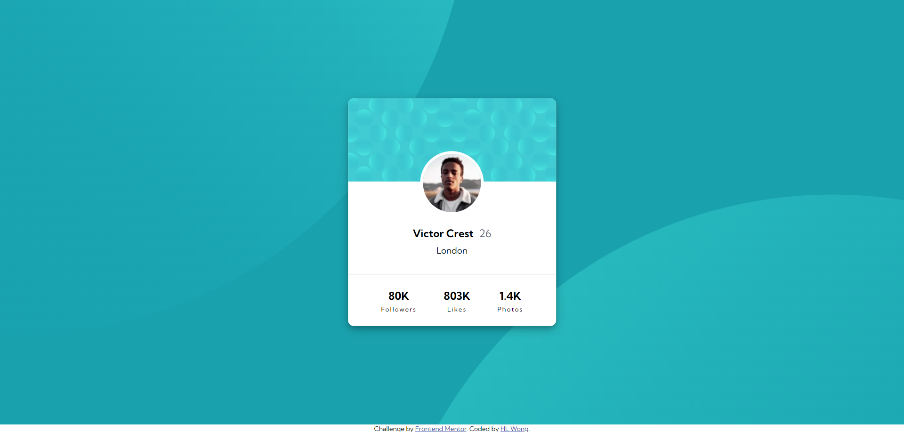
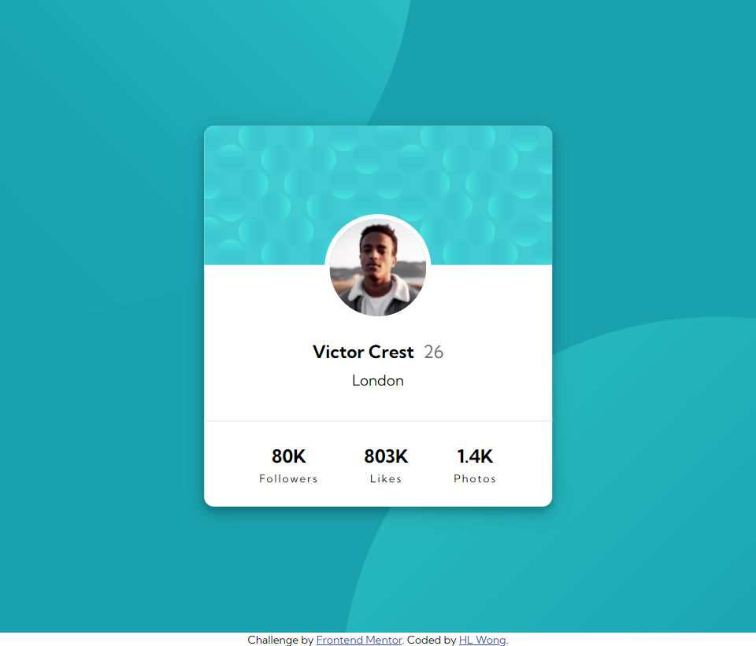
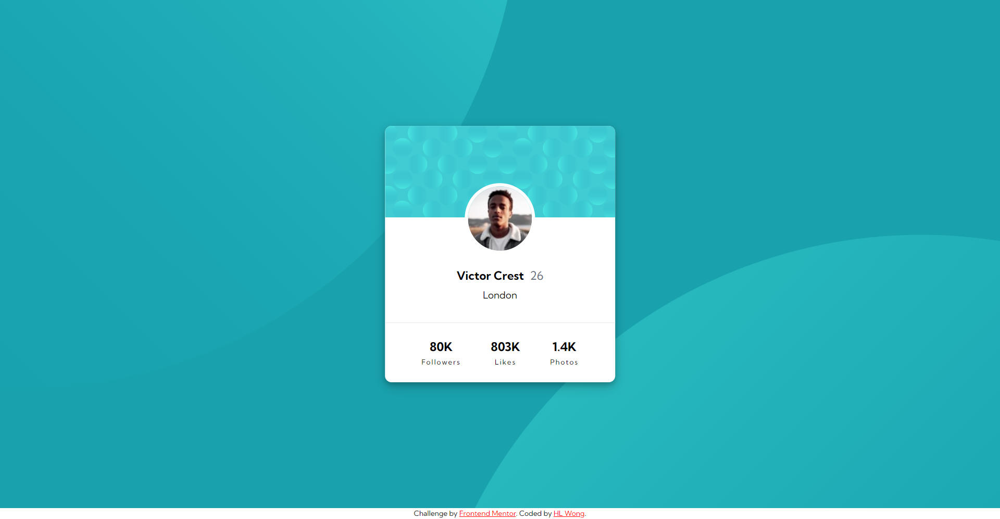
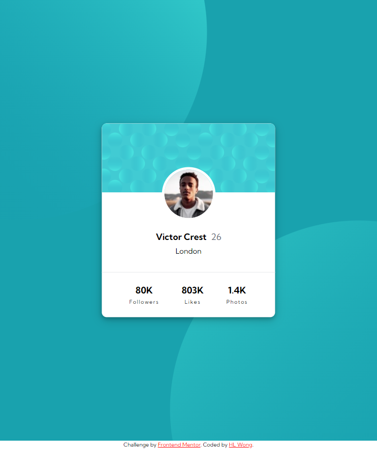

# Frontend Mentor - Profile card component solution

This is a solution to the [Profile card component challenge on Frontend Mentor](https://www.frontendmentor.io/challenges/profile-card-component-cfArpWshJ). Frontend Mentor challenges help you improve your coding skills by building realistic projects. 

## Table of contents

- [Overview](#overview)
  - [The challenge](#the-challenge)
  - [Screenshot](#screenshot)
  - [Links](#links)
- [My process](#my-process)
  - [Built with](#built-with)
  - [What I learned](#what-i-learned)
  - [Continued development](#continued-development)
- [Author](#author)

## Overview

### The challenge

- Build out the project to the designs provided

### Screenshot

**HTML and CSS**

**Tailwind CSS**

### Links

- Solution URL: [Responsive Profile Card Component](https://www.frontendmentor.io/solutions/responsive-profile-card-component-Ft_fpB6q3Q)
- Live Site URL: [Profile Card Component with Tailwind CSS](https://dwz-wong.github.io/profile-card-component/)

## My process

### Built with

- HTML (HyperText Markup Language)
- CSS (Cascading Style Sheets)
- Responsiveness
- [Tailwind CSS](https://tailwindcss.com/)

### What I learned

What I have learned from this project or challenge is how to install and how to use the CSS framework [Tailwind CSS](https://tailwindcss.com/). Not only that, but it also helps me to improve my HTML & CSS skills as well.

### Continued development

I'm still not completely comfortable using [Tailwind CSS](https://tailwindcss.com/) since I'm a beginner, but I will continue to challenge Frontend Mentor projects using the CSS framework [Tailwind CSS](https://tailwindcss.com/) to refine my front-end skills for future projects.

## Author

- Frontend Mentor - [@dwz-wong](https://www.frontendmentor.io/profile/dwz-wong)
- Twitter - [@dwz_wong](https://twitter.com/dwz_wong)
